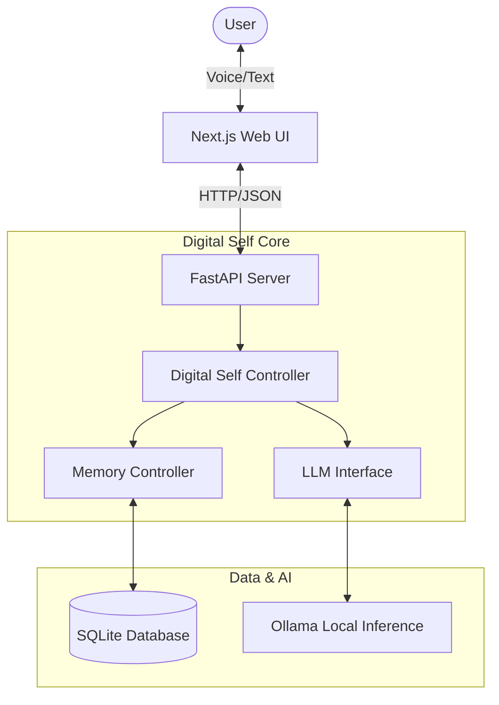

# Digital Self Documentation

This document provides a comprehensive overview of the **Digital Self** system, a personalized AI assistant designed to run locally, mimic the user's personality, and maintain long-term memory.

## 1. System Architecture

The system is composed of a **Next.js Frontend**, a **FastAPI Backend**, and a core **Brain** module that manages intelligence and memory.

### High-Level Architecture



## 2. Component Details

### 2.1 Web UI (Frontend)
- **Path**: `web_ui/`
- **Tech Stack**: Next.js, React, Tailwind CSS, Lucide Icons.
- **Key Features**:
    - **App Directory**: Modern Next.js App Router structure.
    - **Voice Integration**: Uses Web Speech API for speech-to-text (STT) and text-to-speech (TTS).
    - **Continuous Mode**: Allows hands-free conversation loop.
    - **Dynamic Model Loading**: Fetches available Ollama models dynamically.

### 2.2 Backend API
- **Path**: `backend/api_server.py`
- **Tech Stack**: FastAPI, Uvicorn.
- **Key Endpoints**:
    - `POST /chat`: Main chat endpoint. Stream responses from the Digital Self.
    - `GET /memories`: Retrieves all stored long-term memories.
    - `GET /models`: Proxies the list of available models from Ollama.
    - `GET /health`: Health check status.

### 2.3 The Brain (Core Logic)
- **Path**: `brain/` & `digital_self.py`
- **DigitalSelf Class**: The main orchestrator. It initializes the database, loads the identity, and manages the chat loop.
- **MemoryController**:
    - **Classification**: Categorizes information (FACT, PREFERENCE, SKILL, etc.).
    - **Storage**: Saves memories to `digital_self.db`.
    - **Retrieval**: vector/keyword search for relevant context during chat.
- **LLMInterface**:
    - Wraps the `ollama` python library.
    - Manages system prompts and chat history construction.
    - Handles streaming responses.

### 2.4 Database
- **Type**: SQLite (`digital_self.db`)
- **Schema**:
    - **Memories**: Stores content, category, and timestamp.
    - **Identity**: Stores the core personality bio.

## 3. Data Flow

1.  **Input**: User types or speaks into the Web UI.
2.  **Request**: Frontend sends JSON payload `{message: "...", model: "..."}` to `/chat`.
3.  **Processing** (`DigitalSelf.chat`):
    *   **Memory Check**: Is this a command to remember something?
    *   **Context Retrieval**: `MemoryController` searches DB for relevant facts.
    *   **Prompt Engineering**: Constructs `System Prompt + Context + User Input`.
4.  **Inference**: `LLMInterface` sends prompt to local **Ollama** instance.
5.  **Output**: Response is streamed back chunk-by-chunk to the frontend.
6.  **Learning**: The system implicitly analyzes the input to store new facts if valuable.

## 4. Setup & Usage

### Prerequisites
1.  **Ollama**: Installed and running (`ollama serve`).
2.  **Python 3.10+**: For the backend.
3.  **Node.js 18+**: For the frontend.

### Installation

**1. Backend Setup**
```bash
# In project root
python -m venv venv
venv\Scripts\activate
pip install -r requirements.txt
```

**2. Frontend Setup**
```bash
cd web_ui
npm install
```

### Running the System
You can use the provided batch script `run_app.bat` or run manually:

**Terminal 1 (Backend)**:
```bash
python backend/api_server.py
```

**Terminal 2 (Frontend)**:
```bash
cd web_ui
npm run dev
```

Access the UI at `http://localhost:3000`.

## 5. Troubleshooting
-   **Connection Refused**: Ensure the backend is running on port 8000 and Ollama is active.
-   **Voice Issues**: Check browser permissions for Microphone. Chrome is recommended for Web Speech API.
